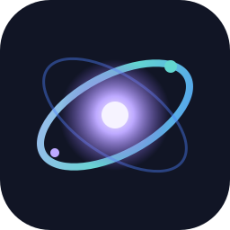

<div align="center">

# ✦ Nebula LIB

**A dimensional, responsive, atmospheric UI framework for Roblox Luau.**

[](CHANGELOG.md)
[](https://luau.org/)
[](LICENSE)



**Clean. Dimensional. Atmospheric. Responsive.**

</div>

---

Nebula LIB is a modular Roblox UI runtime for developers who want application-quality interfaces without rebuilding lifecycle management, themes, layout, animation, and input behavior for every project.

> The project is currently an initial public build. The shipped surface is intentionally documented below; experimental APIs are kept out of the public contract.

## ✦ Features

| Area | What ships |
| --- | --- |
| Runtime | `Nebula.new`, ownership-aware cleanup, debug diagnostics, reduced motion |
| Rendering | Shared component roots for `2D`, `3D`, and `Hybrid` presentation |
| Layout | Row, column, grid, stack, and overlay helpers built on Roblox layout objects |
| Components | Windows, tabs, surfaces, buttons, toggles, sliders, status indicators, command palette, and toast stack |
| Themes | Presets, registration, switching, modification, and per-surface overrides |
| Motion | Centralized fade, slide, scale, color, and spring presets |
| Responsive UI | Viewport breakpoints, safe size helpers, touch-aware control sizing |
| State | Subscription-based values that stay independent from application logic |

## ◈ Installation

Copy the `src/` tree into your Roblox project as a ModuleScript hierarchy, or sync it with Rojo:

```text
src/
└── Nebula.lua
```

Require `src/Nebula.lua` from a LocalScript. Nebula LIB uses Roblox services only and has no runtime package dependency.

## ⚡ Quick start

```lua
local ReplicatedStorage = game:GetService("ReplicatedStorage")
local Nebula = require(ReplicatedStorage.Packages.Nebula)

local app = Nebula.new({
    Parent = game:GetService("Players").LocalPlayer:WaitForChild("PlayerGui"),
    Title = "Signal Console",
    RenderMode = "2D",
    Theme = "Nebula Dark",
})

local window = app:CreateWindow({
    Title = "Signal Console",
    Subtitle = "Live systems overview",
})

local overview = window:AddTab("Overview", "◈")
local card = overview:AddSurface({ Title = "Telemetry" })

card:AddButton({
    Label = "Refresh",
    OnClick = function()
        app:Toast("Telemetry refreshed", "success")
    end,
})

local enabled = card:AddToggle({
    Label = "Live updates",
    Default = true,
    OnChanged = function(value)
        print("Live updates:", value)
    end,
})

-- Call app:Destroy() when the owning feature is unloaded.
```

## 🎨 Themes

```lua
app:RegisterTheme("Ocean", {
    Accent = Color3.fromRGB(84, 189, 255),
    AccentSecondary = Color3.fromRGB(125, 116, 255),
    Surface = Color3.fromRGB(24, 29, 45),
})

app:SetTheme("Ocean")
app:ModifyTheme({ CornerRadius = 14 })
```

Built-in presets are `Nebula Dark`, `Nebula Light`, `Midnight`, `Graphite`, `Aurora`, `Glass`, and `Minimal`.

## 🧩 Components

The initial component set focuses on composable application primitives:

- **Structure:** Window, Tab, Surface, Row, Column, Grid, Stack, Overlay
- **Controls:** Button, Toggle, Slider
- **Feedback:** Status Indicator, Toast Stack
- **Navigation:** Command Palette

Every interactive component provides cleanup-safe connections and an observable state where it has a value.

## 🌀 Animation system

Animations are coordinated through `app.Animations`, not scattered raw `TweenService` calls:

```lua
app.Animations:Fade(surface.Instance, 0)
app.Animations:Spring(surface.Instance, { Size = UDim2.fromOffset(420, 240) })
app.Animations:Play(surface.Instance, { BackgroundTransparency = 0.1 }, "surfaceIn")
```

Set `ReducedMotion = true` to make transitions immediate.

## 📱 Responsive UI

Nebula LIB measures the active camera viewport and exposes the current breakpoint as `Compact`, `Regular`, or `Wide`. The Window adapts navigation visibility and content sizing without scaling desktop coordinates down to unusable touch targets.

## 🌐 2D / 3D / Hybrid rendering

Switch the root presentation without changing component construction:

```lua
app:SetRenderMode("2D")
app:SetRenderMode("3D", {
    Adornee = workspace.Terminal.Screen,
})
app:SetRenderMode("Hybrid")
```

3D and Hybrid modes require an `Adornee` BasePart. The same state and component APIs are used in each mode.

## 🖥 Showcase

Open `examples/Showcase.lua` in a LocalScript to see the framework's dashboard-style surface, theme switching, controls, command palette, toasts, and responsive behavior.

## 📚 Documentation

- [Getting started](docs/getting-started.md)
- [Components](docs/components.md)
- [Themes](docs/themes.md)
- [Animations](docs/animations.md)
- [Rendering](docs/rendering.md)
- [Responsive behavior](docs/responsive.md)
- [State and input](docs/state.md)
- [Layouts](docs/layouts.md)
- [Performance and cleanup](docs/performance.md)
- [API reference](docs/api.md)

## 🛠 Development

The repository is source-first. Keep runtime modules under `src/`, examples under `examples/`, and ensure every public API change has a documentation example. The validation workflow checks required files, Lua source presence, Markdown links, and accidental secret patterns.

## 🤝 Contributing

Read [CONTRIBUTING.md](CONTRIBUTING.md) before opening a pull request. Bug reports and feature proposals have concise templates in `.github/ISSUE_TEMPLATE/`.

## 📜 License

Nebula LIB is available under the [MIT License](LICENSE).

<div align="center">

*Built for interfaces that feel like places, not panels.*

</div>
