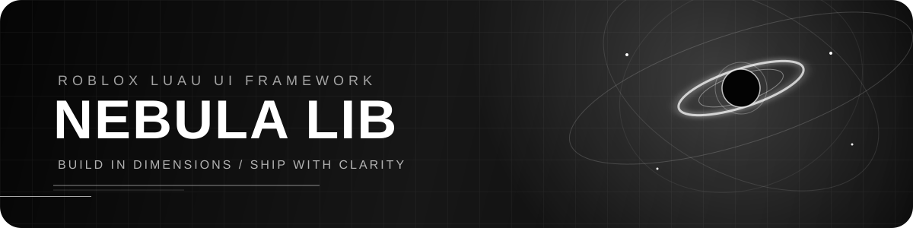

<div align="center">



<br />

[](CHANGELOG.md)
[](https://luau.org/)
[](LICENSE)

<br />

**Wrath was here ;).**

<br />

<a href="#-feature-deck">Explore the feature deck</a>
&nbsp;&nbsp;·&nbsp;&nbsp;
<a href="#-quick-start">Launch in minutes</a>
&nbsp;&nbsp;·&nbsp;&nbsp;
<a href="#-documentation">Read the docs</a>

</div>

<br />

> **Nebula LIB** gives Roblox developers a composed UI foundation: responsive surfaces, shared motion, observable state, flexible rendering roots, and cleanup that does not get forgotten. Its visual language borrows from orbital paths and event horizons; every metaphor points back to a real runtime feature.

<div align="center">

`2D` &nbsp; `3D` &nbsp; `HYBRID` &nbsp; `TOUCH-READY` &nbsp; `CLEANUP-SAFE`

</div>

---

## ◌ Feature deck

The sections below are interactive. Open a category to see the complete shipped feature list.

<details open>
<summary><strong>◈ Runtime foundation</strong> — the app lifecycle and public API</summary>

- [x] `Nebula.new(options)` application instance
- [x] `CreateWindow(options?)` window factory
- [x] Automatic `UI Settings` tab on every window
- [x] `Destroy()` teardown for the complete UI tree
- [x] `GetDiagnostics()` with component count, viewport, breakpoint, render mode, and active animations
- [x] Debug flag and reduced-motion switch
- [x] `Maid` cleanup for instances, connections, threads, callbacks, and destroyable objects
- [x] `Signal` event primitive
- [x] `Value` observable state primitive with `Get`, `Set`, and `Subscribe`

</details>

<details>
<summary><strong>▣ Rendering</strong> — one component model, three presentation modes</summary>

- [x] `2D` `ScreenGui` root
- [x] `3D` `SurfaceGui` root attached to an `Adornee` `BasePart`
- [x] `Hybrid` surface plus screen overlay root
- [x] Configurable `Face`, `PixelsPerStud`, and `DisplayOrder`
- [x] Runtime render-mode switching
- [x] Shared window and component construction across modes

</details>

<details>
<summary><strong>▤ Components</strong> — composable application primitives</summary>

- [x] `Window` with title bar, navigation, content region, and responsive sizing
- [x] `Tab` navigation with selection state
- [x] `Surface` content cards with title and layout support
- [x] `Button` with `Activated` input
- [x] `Toggle` with observable boolean state
- [x] `Slider` with mouse and touch dragging, range limits, formatting, and callbacks
- [x] `Command Palette` with keyboard toggle and filtered commands
- [x] `Toast Stack` with success, warning, error, and info messages
- [x] Component-level cleanup and theme references

</details>

<details>
<summary><strong>⌗ Layout</strong> — predictable Roblox-native composition</summary>

- [x] Row layout helper
- [x] Column layout helper
- [x] Grid layout helper
- [x] Stack layout helper
- [x] Overlay layout helper
- [x] Spacing, padding, wrapping, cell sizing, and layout ordering

</details>

<details>
<summary><strong>✦ Themes</strong> — make the system yours</summary>

- [x] Seven built-in presets: Nebula Dark, Nebula Light, Midnight, Graphite, Aurora, Glass, and Minimal
- [x] `RegisterTheme(name, theme)`
- [x] `SetTheme(name)`
- [x] `GetTheme()`
- [x] `ModifyTheme(changes)`
- [x] `ResetTheme()`
- [x] Theme change notifications
- [x] Shared theme tokens for surfaces, text, borders, accents, and radii

</details>

<details>
<summary><strong>↝ Motion</strong> — centralized, interruptible animation</summary>

- [x] Shared `Animator` service
- [x] Fade transitions
- [x] Scale transitions
- [x] Spring transitions
- [x] Slide and rotation helpers
- [x] Staggered multi-instance transitions
- [x] Generic property tweening
- [x] `surfaceIn`, `control`, `spring`, `quick`, `reveal`, and `orbit` presets
- [x] Animated window entrance, tab reveal, and button hover response
- [x] Active-animation tracking
- [x] Existing tweens cancel before a replacement starts
- [x] Reduced-motion mode applies state immediately

</details>

<details>
<summary><strong>⌁ Responsive behavior</strong> — desktop room without breaking touch</summary>

- [x] `Compact`, `Regular`, and `Wide` viewport breakpoints
- [x] Compact horizontal, touch-scrollable navigation
- [x] Safe window margins on small viewports
- [x] Adaptive content positioning and sizing
- [x] Mouse and touch dragging constrained to the viewport
- [x] Touch-compatible `Activated` controls
- [x] Camera viewport change handling

</details>

<details>
<summary><strong>◫ Developer experience</strong> — stay in control</summary>

- [x] Source modules retained for rebuilding the standalone package
- [x] No runtime package dependency beyond Roblox services
- [x] Strict Luau annotations in runtime modules
- [x] Showcase example with dashboard surfaces, controls, themes, commands, diagnostics, and toasts
- [x] API reference and focused guides
- [x] MIT license, changelog, contribution guide, code of conduct, and security policy

</details>

---

## ⌁ Quick start

For a normal Roblox ModuleScript installation, place the `src/` directory in your
package and require its ModuleScript entry point. `src/Nebula.lua` delegates to
`src/NebulaCore.lua`, so it preserves the modular source hierarchy and exposes the
same API as the standalone distribution.

```lua
local ReplicatedStorage = game:GetService("ReplicatedStorage")
local Nebula = require(
    ReplicatedStorage:WaitForChild("Nebula"):WaitForChild("src"):WaitForChild("Nebula")
)

local app = Nebula.new({
    Parent = game:GetService("Players").LocalPlayer:WaitForChild("PlayerGui"),
    RenderMode = "2D",
    Theme = "Nebula Dark",
})

local window = app:CreateWindow({
    Title = "Signal Console",
    Subtitle = "Live systems overview",
})

-- Every window also receives a built-in "UI Settings" tab with
-- theme and reduced-motion controls.

local overview = window:AddTab("Overview", "◈")
local telemetry = overview:AddSurface({ Title = "Telemetry" })

telemetry:AddButton({
    Label = "Refresh",
    OnClick = function()
        app:Toast("Telemetry refreshed", "success")
    end,
})

telemetry:AddToggle({
    Label = "Live updates",
    Default = true,
    OnChanged = function(value)
        print("Live updates:", value)
    end,
})

-- Call app:Destroy() when the owning feature is unloaded.
```

<details>
<summary><strong>⌘ See the command palette setup</strong></summary>

```lua
local app = Nebula.new({
    Commands = {
        {
            Label = "Open diagnostics",
            OnSelect = function()
                print(app:GetDiagnostics())
            end,
        },
        {
            Label = "Use monochrome theme",
            OnSelect = function()
                app:SetTheme("Graphite")
            end,
        },
    },
})

app.Commands:Open()
```

</details>

---

## LOADSTRING INSTALLATION

`src/` contains the maintainable modular development source. `dist/Nebula.lua`
is the generated, self-contained loadstring distribution; it includes only the
modules reachable from the public entry point and does not require the original
ModuleScript hierarchy at runtime.

Use the loadstring method only in a trusted, compatible runtime that intentionally
provides both `game:HttpGet` and `loadstring`. The standard Roblox client does not
enable this pattern for ordinary LocalScripts.

```lua
local Nebula = loadstring(game:HttpGet(
    "https://raw.githubusercontent.com/famefashion/nebula-lib/main/dist/Nebula.lua"
))()

local App = Nebula.new({
    Parent = game:GetService("Players").LocalPlayer:WaitForChild("PlayerGui"),
    RenderMode = "2D",
    Theme = "Nebula Dark",
})
```

For a full runtime check, paste
[`examples/LoadstringSmokeTest.lua`](examples/LoadstringSmokeTest.lua) into your
controlled executor. It checks the loader, documented runtime methods, controls,
commands, themes, rendering mode, and animations. If a check fails, it prints the
traceback and attempts to copy it with `setclipboard` or `toclipboard`.

For a ready-to-run three-tab window with overview, controls, and diagnostics, see
[`examples/ThreeTabShowcase.lua`](examples/ThreeTabShowcase.lua).

Remote code executes with the permissions of its host. Review the source and pin a release tag or commit SHA for anything you expect to keep stable; the `main` URL intentionally follows the latest commit.

## ◉ Build and validation

Node.js is only needed to rebuild or validate the distribution:

```bash
npm run build
npm test
```

The build reads the actual `src/NebulaCore.lua` dependency graph, emits one
factory per reachable module, and writes `dist/Nebula.lua`. The checks verify that
the output is deterministic, has no unresolved `require(script...)` calls, does
not duplicate modules, returns the Nebula API, and keeps the documented public
methods—including `Nebula.VERSION`.

## ◉ Orbit map

Open a node to jump from the visual model to the matching API. “Orbit” and “event horizon” are labels for actual UI behavior, not separate dependencies.

<details>
<summary><strong>Core orbit</strong> — runtime, themes, and diagnostics</summary>

- [Runtime and theme methods](docs/api.md#runtime-methods)
- [Responsive rendering roots](docs/rendering.md)
- [Theme tokens and presets](docs/themes.md)

</details>

<details>
<summary><strong>Control orbit</strong> — windows, tabs, surfaces, and input</summary>

- [Window, tab, and control API](docs/components.md)
- [State and input behavior](docs/state.md)
- [Command palette and toast stack](docs/components.md#command-palette)

</details>

<details>
<summary><strong>Motion orbit</strong> — reveal, spring, slide, rotate, and stagger</summary>

- [Animation API and examples](docs/animations.md)
- [Single-file loadstring smoke test](examples/LoadstringSmokeTest.lua)

</details>

---

## ◐ Theme the event horizon

Nebula LIB ships monochrome-ready, but every surface reads from shared tokens:

```lua
app:RegisterTheme("Obsidian", {
    Accent = Color3.fromRGB(255, 255, 255),
    AccentSecondary = Color3.fromRGB(180, 180, 180),
    Surface = Color3.fromRGB(14, 14, 14),
    SurfaceSecondary = Color3.fromRGB(24, 24, 24),
})

app:SetTheme("Obsidian")
app:ModifyTheme({ CornerRadius = 14 })
```

Built-in presets: `Nebula Dark`, `Nebula Light`, `Midnight`, `Graphite`, `Aurora`, `Glass`, and `Minimal`.

---

## ◇ Render anywhere

The component API stays the same while the root changes:

```lua
app:SetRenderMode("2D")

app:SetRenderMode("3D", {
    Adornee = workspace.Terminal.Screen,
})

app:SetRenderMode("Hybrid", {
    Adornee = workspace.Terminal.Screen,
})
```

`3D` and `Hybrid` modes require an `Adornee` `BasePart`. Configure `Face` and `PixelsPerStud` when the physical display needs a different orientation or density.

---

## ∿ Motion around the black hole

Animations are coordinated through `app.Animations`, not scattered raw `TweenService` calls:

```lua
local motion = app.Animations
motion:Fade(surface.Instance, 0.08, "control")
motion:Slide(surface.Instance, UDim2.fromOffset(8, 0), "reveal")
motion:Rotate(surface.Instance, 0, "orbit")
motion:Stagger(
    { surfaceA.Instance, surfaceB.Instance },
    { BackgroundTransparency = 0.04 },
    "surfaceIn",
    0.06
)

app:SetReducedMotion(true) -- transitions become immediate
```

---

## ⌂ Showcase

Open [`examples/Showcase.lua`](examples/Showcase.lua) in a `LocalScript` to see:

```text
dashboard surfaces  →  controls  →  theme switching
command palette     →  toasts    →  diagnostics
compact layout      →  touch input → responsive window sizing
```

For the single-file loader and interactive API smoke test, see [`examples/LoadstringSmokeTest.lua`](examples/LoadstringSmokeTest.lua).

---

## ◒ Documentation

<div align="center">

| Start here | Build with it | Go deeper |
| --- | --- | --- |
| [Getting started](docs/getting-started.md) | [Components](docs/components.md) | [API reference](docs/api.md) |
| [Installation](docs/installation.md) | [Themes](docs/themes.md) | [Performance and cleanup](docs/performance.md) |
| [Showcase](examples/Showcase.lua) | [Layouts](docs/layouts.md) | [Rendering](docs/rendering.md) |
|  | [Animations](docs/animations.md) | [Responsive behavior](docs/responsive.md) |
|  | [State and input](docs/state.md) |  |

</div>

---

## ⌘ Contributing

The repository is source-first. Keep runtime modules under `src/`, examples under `examples/`, and add a documentation example for every public API change.

Read [CONTRIBUTING.md](CONTRIBUTING.md) before opening a pull request. See [SECURITY.md](SECURITY.md) for vulnerability reports.

<div align="center">

<br />

**Black canvas. White signal. Infinite surfaces.**

<br />

*Built for interfaces that feel like places, not panels.*

</div>
